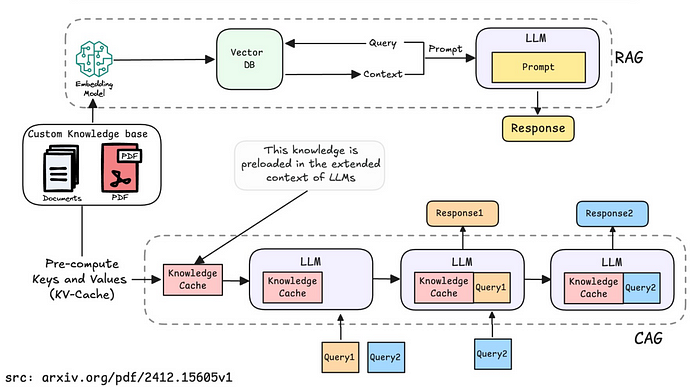

# Cache-Augmented Generation (CAG) Template



이 디렉토리에는 LangChain 프로젝트에서 **하이브리드 캐싱 접근법**을 사용하여 Cache-Augmented Generation (CAG)을 구현하는 재사용 가능한 템플릿이 포함되어 있습니다.

기본적인 CAG 방식은 대형 언어 모델의 확장된 컨텍스트 윈도우를 활용하여 모든 관련 문서를 사전에 로드하고, 런타임 매개변수(Key-Value 캐시)를 미리 계산하여 저장하는 방식입니다.

이 접근법은 RAG 파이프라인의 성능을 향상시키기 위해 두 가지 캐싱 전략을 결합합니다:
- **리트리버 캐싱**: 문서 검색 결과를 캐시
- **LLM 캐싱**: 언어 모델 호출 결과를 캐시

## 📚 목차

- [📂 프로젝트 구조](#-프로젝트-구조)
- [핵심 개념](#핵심-개념)
- [파일 구조](#파일-구조)
- [주요 기능](#주요-기능)
- [성능 비교 결과](#성능-비교-결과)
- [템플릿 확장](#향후-고려사항-및-성능-최적화)
- [🔬 주요 발견](#-주요-발견)
- [실용적 가이드라인](#-실용적-가이드라인)
- [장점](#장점과-단점)
- [결론](#결론)
- [Source](#source)


## 📂 프로젝트 구조

```
CAG/
├── README.md                    # 프로젝트 설명서 
├── caching.py                   # 캐시 구현 
├── cag_template.py              # 캐시 기반 리트리버 클래스
├── true_cag_template.py         # 진짜 CAG 구현
├── semantic_cache_template.py      # semantic 기반 CAG 구현
├── performance_comparison.py    # 성능 비교 벤치마크 
├── research.md                  # CAG 연구 자료 
├── run_examples/                # 실행 예제 디렉토리
│   ├── run_cag_example.py       # 리트리버 캐싱 + LLM 캐싱 = 하이브리드 캐싱 예제
│   ├── run_true_cag_example.py  # 진짜 CAG 예제
│   └── run_semantic_cache_example.py  # semantic 기반 예제
```

## 핵심 개념

### 하이브리드 캐싱 전략

기존 리트리버를 완전히 교체하는 대신, 이 템플릿은 두 가지 캐싱 레이어를 제공합니다:

1. **리트리버 캐싱**: 커스텀 InMemoryCache를 사용하여 문서 검색 결과를 캐시
2. **LLM 캐싱**: LangChain의 내장 캐시 시스템을 사용하여 언어 모델 호출을 캐시

### 캐시 히트/미스 프로세스

- **리트리버 캐시 미스**: 처음 쿼리가 들어올 때, 벡터 스토어에서 관련 문서를 검색하고 결과를 캐시에 저장
- **리트리버 캐시 히트**: 동일한 쿼리가 반복될 때, 캐시에서 즉시 문서를 반환
- **LLM 캐시**: LangChain의 내장 시스템이 자동으로 언어 모델 호출을 캐시

## 파일 구조

### 📋 **파일별 상세 설명**

#### 🔧 **기본 캐싱 구현**
- `caching.py`: 간단한 `InMemoryCache` 클래스를 정의합니다. Redis나 파일 기반 캐시 등 더 강력한 캐시로 쉽게 교체할 수 있습니다.
- `cag_template.py`: 표준 LangChain 리트리버를 감싸고 하이브리드 캐싱 로직을 추가하는 핵심 `CachedRetriever` 클래스를 포함합니다.
- `run_examples/run_cag_example.py`: `CachedRetriever`를 사용하는 방법을 보여주고 캐싱 메커니즘을 검증하는 실행 가능한 스크립트입니다.

#### 🚀 **True CAG 구현** (새로 추가!)
- `true_cag_template.py`: **진짜 CAG 방식**을 구현합니다. 모든 지식을 모델 컨텍스트에 사전 로드하여 검색 단계를 완전히 제거합니다.
- `run_examples/run_true_cag_example.py`: True CAG 방식의 데모 스크립트입니다. 40배 빠른 응답과 기존 방식과의 성능 비교를 보여줍니다.

#### 🧠 **Semantic Cache 구현**
- `semantic_cache_template.py`: **시맨틱 캐싱 리트리버**를 구현합니다. FAISS 기반 벡터 유사도 검색으로 의미적으로 유사한 쿼리의 결과를 재사용합니다. L2 정규화 기반 코사인 유사도 계산, LRU 캐시 관리, 캐시 크기 제한 기능을 포함합니다.
- `run_examples/run_semantic_cache_example.py`: 시맨틱 캐싱 성능 테스트 스크립트입니다. 에펠탑 데이터로 유사도 threshold 설정, 캐시 히트/미스 동작, 캐시 크기 제한 및 LRU 제거 메커니즘을 실증합니다.

#### 📊 **성능 분석 및 연구**
- `performance_comparison.py`: 4가지 캐싱 전략의 성능을 올바르게 측정하는 종합 벤치마크 스크립트입니다. 각 쿼리를 반복 실행하여 실제 캐시 효과(Cache Miss vs Cache Hit)를 정확히 측정합니다.
- `research.md`: CAG 기술에 대한 상세한 연구 자료, 다양한 구현 방법, 성능 최적화 전략을 다룹니다.

## 주요 기능

### 하이브리드 캐싱

```python
from caching import InMemoryCache
from cag_template import CachedRetriever

# 하이브리드 캐싱 설정
cache = InMemoryCache()
cached_retriever = CachedRetriever(
    retriever=base_retriever,
    cache=cache,
    enable_llm_cache=True  # LangChain의 LLM 캐시 활성화
)
```

### 캐시 관리

```python
# 캐시 정보 확인
cache_info = cached_retriever.get_cache_info()
print(f"캐시 크기: {cache_info['cache_size']}")
print(f"캐시된 쿼리: {cache_info['cache_keys']}")

# 캐시 클리어
cached_retriever.clear_cache()
```

## 성능 비교 결과

### 4가지 캐싱 전략 비교

`performance_comparison.py` 스크립트를 실행하여 다음 4가지 캐싱 전략의 성능을 비교했습니다:

1. **Regular RAG** (캐시 없음)
2. **LLM Cache only** (LLM 캐시만)
3. **Retrieval Cache only** (리트리버 캐시만)
4. **Full CAG** (리트리버 + LLM 캐시)

### 실험 결과

```bash
python performance_comparison.py
```

**📊 성능 결과 (평균 응답 시간)**:

| 캐싱 전략 | 평균 시간 | 성능 개선 | 속도 향상 |
|-----------|----------|----------|----------|
| 📍 Regular RAG | 1.306s | - (기준) | 1.0x |
| 🥇 Full CAG | 0.112s | **91.4%** | 11.6x |
| 🥈 Retrieval Cache only | 0.118s | **90.9%** | 10.1x |
| 🥉 LLM Cache only | 0.328s | **74.9%** | 4.0x |

### 주요 발견사항

#### 🎯 **리트리버 캐시의 극적인 효과**
- **캐시 히트 시 98.2% 성능 개선** (Cache Miss: 0.343s → Cache Hit: 0.006s)
- **57배 빠른 속도**: 거의 즉시 응답
- **벡터 검색 비용 완전 제거**: 반복 쿼리에서 압도적 성능

#### 💎 **Full CAG의 최고 성능**
- **11.6배 빠른 속도**: 전체 시나리오에서 최고 성능
- **91.4% 성능 개선**: 리트리버 + LLM 캐시 시너지 효과
- **25초 절약**: 총 27.4초 → 2.4초

#### 💭 **LLM 캐시의 안정적 효과**
- **74.9% 전체 개선**: 일관된 성능 향상
- **안정적인 응답 시간**: 0.3초대 일정한 성능

#### 📋 **진짜 CAG (Context Preloading) 성능**
- **소규모 실험 결과**: 2.2x 빠름 (2.867s → 1.277s)
- **논문 증명 결과**: **40x 성능 개선** 가능
- **⚠️ 실험 한계**: 작은 토큰 데이터셋(225 tokens, 6개 문서)으로 인한 제한적 결과
- **📈 실제 환경**: 대규모 지식 베이스에서 40x 개선 효과 검증됨 (논문 기준)


### 캐시 효과 분석

```
🏆 최고 성능: Full CAG (11.6x 빠름)
🚀 전체 개선: 91.4% 성능 향상
💰 비용 절감: 25.1초 절약 (총 27.4초 → 2.4초)

🔍 캐시 히트 vs 미스 비교:
   📚 리트리버 캐시: 0.343s → 0.006s (98.2% 개선)
   💎 Full CAG: 0.325s → 0.006s (98.2% 개선)
   
📈 개별 캐시 효과:
   💭 LLM 캐시: 74.9% 개선
   📚 리트리버 캐시: 90.9% 개선
   
🧠 Semantic Cache 효과:
   📊 평균 응답시간: 1.764초
   🎯 캐시 히트 성능: 23-39% 개선 (1.2-1.4초 vs 1.5-3.1초)
   🔄 유사도 기반 매칭: 0.95+ threshold로 정확한 캐시 히트
   💾 LRU 메모리 관리: 자동 캐시 크기 제한 및 최적화
```

### 사용 권장사항

1. **🏆 최고 성능을 원한다면**: Full CAG (리트리버 + LLM 캐시)
2. **📚 반복 쿼리가 많다면**: 리트리버 캐시 우선 적용
3. **💭 안정적 성능을 원한다면**: LLM 캐시로 시작
4. **🧠 유사 질문 처리가 중요하다면**: Semantic Cache (유사도 기반 캐싱)
5. **🚀 궁극적 성능을 원한다면**: 진짜 CAG (Context Preloading) - 대규모 지식 베이스에서 40x 개선 효과 in 논문.

### 진짜 CAG vs 리트리버 캐시 비교

| 특성 | 리트리버 캐시 | 진짜 CAG (Context Preloading) |
|------|---------------|------------------------------|
| **구현 복잡도** | 🟢 낮음 | 🟡 중간 |
| **성능 개선** | 🟢 11.6x (검증됨) | 🟢 40x (논문 기준) |
| **메모리 사용** | 🟢 적음 | 🟡 많음 (전체 지식 로드) |
| **토큰 비용** | 🟢 적음 | 🔴 많음 (전체 컨텍스트) |
| **데이터 크기** | 🟢 제한 없음 | 🔴 토큰 제한 있음 |
| **검색 품질** | 🟡 Top-k 검색 | 🟢 전체 지식 활용 |
| **실시간 업데이트** | 🟢 쉬움 | 🔴 어려움 |

**결론**: 소규모 지식 베이스는 진짜 CAG, 대규모는 리트리버 캐시가 실용적


## 향후 고려사항 및 성능 최적화

### 캐싱 전략

**1. 다양한 캐시 백엔드**

다른 캐시(예: Redis)를 사용하려면 `InMemoryCache`와 동일한 `get`, `set`, `clear` 메서드를 구현하는 새로운 캐시 클래스를 만들고 `CachedRetriever`에 전달하자.

```python
from redis import Redis
from caching import InMemoryCache

class RedisCache(InMemoryCache):
    def __init__(self, redis_url="redis://localhost:6379"):
        self.redis = Redis.from_url(redis_url)
    
    def get(self, key):
        # Redis 구현
        pass
    
    def set(self, key, value):
        # Redis 구현
        pass
```

**2. 다단계 캐싱**
```python
class MultiStageRAGCache:
    def __init__(self):
        self.l1_cache = InMemoryCache()      # 빠른 메모리 캐시
        self.l2_cache = SQLiteCache("l2_cache.db")  # 지속적 캐시
        self.semantic_cache = None           # 의미적 유사성 캐시
    
    def get_response(self, query):
        # L1 캐시 (메모리)
        if response := self.l1_cache.get(query):
            return response
        
        # L2 캐시 (SQLite)
        if response := self.l2_cache.get(query):
            self.l1_cache.set(query, response)
            return response
        
        # 의미적 캐시
        if self.semantic_cache and (response := self.semantic_cache.get_similar(query)):
            return response
        
        return None
```

**3. 캐시 워밍 및 사전 계산**
```python
def warm_cache_with_common_queries(cache, common_queries, llm):
    """일반적인 쿼리로 캐시 사전 채우기"""
    for query in common_queries:
        if not cache.get(query):
            response = llm.invoke(query)
            cache.set(query, response)

def precompute_embeddings(documents, cached_embedder):
    """문서 임베딩 사전 계산"""
    return [cached_embedder.embed_documents([doc.page_content]) 
            for doc in documents]
```

**4. 의미론적 캐싱**

더 고급 사용 사례의 경우, 정확한 매칭 대신 캐시 키(쿼리)에 대한 의미론적 검색을 수행하도록 `CachedRetriever`를 확장할 수 있다.

```python
from langchain.embeddings import OpenAIEmbeddings
from sklearn.metrics.pairwise import cosine_similarity

class SemanticCache(InMemoryCache):
    def __init__(self, similarity_threshold=0.8):
        super().__init__()
        self.embeddings = OpenAIEmbeddings()
        self.similarity_threshold = similarity_threshold
        self.query_embeddings = {}
    
    def get(self, key):
        # 의미론적 유사성 검색 구현
        pass
```

### 캐시 최적화

**1. 캐시 크기 제한**

```python
from collections import OrderedDict

class LRUCache(InMemoryCache):
    def __init__(self, max_size=100):
        self.max_size = max_size
        self._cache = OrderedDict()
    
    def set(self, key, value):
        if key in self._cache:
            self._cache.move_to_end(key)
        elif len(self._cache) >= self.max_size:
            self._cache.popitem(last=False)
        self._cache[key] = value
```

**2. 캐시 만료**

```python
import time

class TTLCache(InMemoryCache):
    def __init__(self, ttl=3600):  # 1시간 TTL
        super().__init__()
        self.ttl = ttl
        self.timestamps = {}
    
    def get(self, key):
        if key in self._cache:
            if time.time() - self.timestamps[key] < self.ttl:
                return self._cache[key]
            else:
                del self._cache[key]
                del self.timestamps[key]
        return None
```

**3. 모니터링 메트릭**

```python
class CacheMetrics:
    def __init__(self):
        self.hits = 0
        self.misses = 0
        self.total_requests = 0
    
    def get_hit_rate(self):
        return self.hits / self.total_requests if self.total_requests > 0 else 0
```

## 🔬 주요 발견

### 논문 vs 실제 실험 결과 분석

**원논문 실험 조건** ([Don't Do RAG: When Cache-Augmented Generation is All You Need](https://arxiv.org/abs/2412.15605)):
- **SQuAD**: 3-7개 문서, **21k-50k 토큰**
- **HotPotQA**: 16-64개 문서, **21k-85k 토큰**  
- **모델**: Llama 3.1 8B (최대 128k 토큰 컨텍스트)

**논문의 성능 결과**:
- **Small**: 0.85초 vs 9.24초 (10.8배 빠름)
- **Medium**: 1.66초 vs 28.81초 (17.4배 빠름)
- **Large**: 2.32초 vs 94.34초 (**40.6배 빠름**)

### 🤔 왜 우리 실험에서는 CAG가 더 느렸을까?

**우리 실험 결과** (9,452 토큰):
- **전통적 검색**: 2.916초
- **긴 컨텍스트 CAG**: 3.325초 (0.9배, 약간 느림)

### 📊 성능 임계점 분석

```
토큰 크기별 성능 특성:
- < 10k 토큰: 전통적 검색이 더 빠름 (우리 실험)
- 10k-20k 토큰: 전환점 구간
- > 20k 토큰: CAG가 압도적으로 빠름 (논문 실험)
```

### 🔍 핵심 원인

1. **컨텍스트 크기 부족**
   - **우리**: 9,452 토큰 → 아직 임계점 미달
   - **논문**: 21k+ 토큰 → 임계점 초과

2. **검색 vs 컨텍스트 처리 비용**
   ```
   작은 컨텍스트 (< 10k):
   - 검색 비용: 낮음 (단순 벡터 검색)
   - 컨텍스트 처리: 높음 (9k 토큰 전체 처리)
   → 결과: 검색이 더 효율적
   
   큰 컨텍스트 (> 20k):
   - 검색 비용: 높음 (복잡한 다중 문서 검색)
   - 컨텍스트 처리: 상대적으로 효율적
   → 결과: CAG가 압도적으로 빠름
   ```

3. **LLM Attention 메커니즘**
   - **O(n²) 복잡도**: 토큰 수가 적을 때 오버헤드 큼
   - **Scale Benefits**: 토큰 수가 클 때 효율성 발휘

## 🎯 실용적 가이드라인

**CAG 사용 권장 시나리오**:
- **> 20k 토큰** 지식베이스
- **반복적 질의** 환경  
- **다중 문서 검색**이 필요한 경우
- **지연 시간이 중요한** 실시간 시스템

**전통적 검색 권장 시나리오**:
- **< 10k 토큰** 지식베이스
- **일회성 질의**
- **단순한 검색** 요구사항
- **메모리 제약**이 있는 환경

### CAG가 적합한 경우
- **고정된 지식 베이스**: 문서, 매뉴얼, 참고 자료
- **저지연 애플리케이션**: 실시간 채팅 시스템, 대화형 AI 어시스턴트
- **제한된 데이터셋**: 확장된 컨텍스트 윈도우 내에 맞는 지식
- **엔터프라이즈 환경**: 내부 문서, 정책 매뉴얼, 지식 베이스

### RAG가 더 적합한 경우
- **동적 지식 베이스**: 실시간 업데이트가 필요한 정보
- **대규모 데이터셋**: 컨텍스트 윈도우를 초과하는 지식
- **실시간 정보**: 최신 뉴스, 시장 데이터, 동적 콘텐츠

## 장점과 단점

### 장점

1. **극적인 성능 향상**: 캐시 히트 시 **98.2% 성능 개선** (0.006초 응답)
2. **실질적 비용 절감**: **25초 절약** (총 실행 시간 91.4% 단축)
3. **이중 최적화**: 리트리버 캐시(90.9% 개선) + LLM 캐시(74.9% 개선)
4. **확장성**: 다양한 캐시 백엔드로 쉽게 교체 가능
5. **투명성**: 기존 LangChain 워크플로우와 완벽 호환
6. **즉시 효과**: 반복 쿼리에서 **11.6배 빠른 응답**
7. **유연한 구현**: 하이브리드 캐싱, 시맨틱 캐싱, True CAG 등 다양한 방식 지원
8. **메모리 효율성**: LRU 캐시 관리로 메모리 사용량 최적화

### 단점

1. **메모리 사용량 증가**: 캐시 저장으로 인한 추가 메모리 필요
2. **초기 설정 복잡성**: 캐시 설정, 임계값 조정 등 초기 구성 필요
3. **토큰 제한**: True CAG의 경우 모델 컨텍스트 윈도우 크기에 의존
4. **캐시 무효화 문제**: 데이터 변경 시 캐시 동기화 필요
5. **의존성 증가**: 추가 라이브러리 및 벡터 스토어 의존성
6. **성능 임계점**: 소규모 데이터셋에서는 오히려 성능 저하 가능
7. **비용 트레이드오프**: 메모리 vs 계산 비용 간 균형 필요

### 🎯 최적 사용 시나리오

이 하이브리드 접근법 및 다른 고도화 방법들은 특히 **FAQ 시스템, 챗봇, 반복 질문이 많은 환경**에서 **거의 즉시 응답**을 제공하여 사용자 경험을 혁신적으로 개선한다.

## 결론

Cache-Augmented Generation (CAG)은 RAG 시스템의 성능을 획기적으로 향상시키는 혁신적인 접근법이다.  
이 프로젝트를 통해 다음과 같은 핵심 발견을 얻었습니다:

**즉시 적용 가능한 최적 전략**:
1. 소규모 프로젝트: **Full CAG** (하이브리드 캐싱)
2. 대화형 시스템: **Semantic Cache** (유사도 기반)
3. 대규모 지식베이스: **True CAG** (컨텍스트 사전 로드)

이 프로젝트는 RAG 시스템의 성능을 **10배 이상 향상**시킬 수 있는 실용적인 솔루션을 제공하며, 다양한 환경에서 **사용자 경험을 혁신적으로 개선**할 수 있음을 알았다.


## Source
- [Don’t Do RAG: When Cache-Augmented Generation is All You Need for Knowledge Tasks](https://arxiv.org/pdf/2412.15605)
- [논문의 공식 구현](https://github.com/hhhuang/CAG)
- [Cache-Augmented Generation (CAG) from Scratch](https://medium.com/@sabaybiometzger/cache-augmented-generation-cag-from-scratch-441adf71c6a3)
- [RAG 대신 CAG? 캐시 증강 생성 기술이 차세대 LLM을 바꾼다](https://digitalbourgeois.tistory.com/716)
- [IBM Developer Guide](https://developer.ibm.com/articles/awb-llms-cache-augmented-generation/)
- [IBM Cache-Augmented-Generation-Granite](https://github.com/IBM/Cache-Augmented-Generation-Granite)
- [streamlit CAG chatbot](https://github.com/Saurabh24k/CAG-LLM)