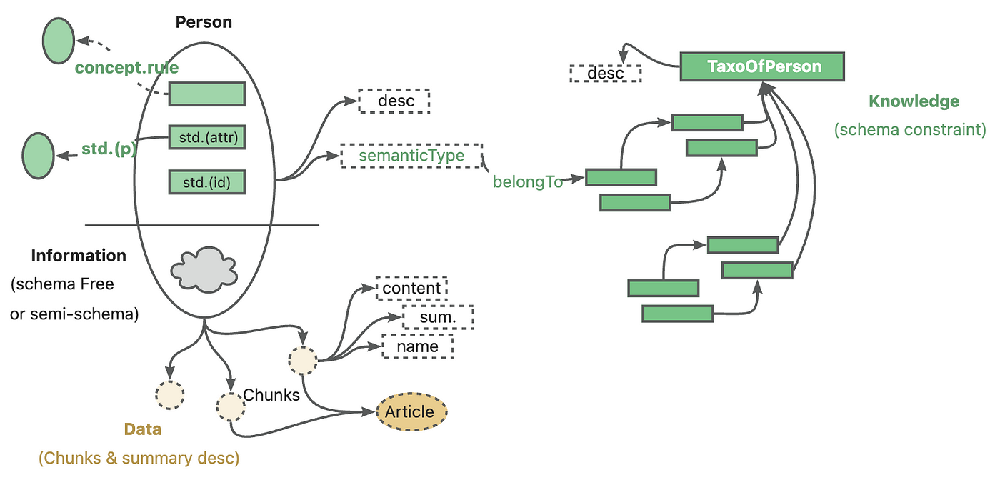

# LangChain and LangGraph Study Projects

이 저장소는 LangChain을 사용하여 고급 RAG(Retrieval-Augmented Generation) 기법을 구현하고, 관련 기술들을 학습하기 위한 개인 연구 공간입니다. 표준적인 RAG를 넘어, 더 정확하고 신뢰성 높은 LLM 애플리케이션을 구축하기 위한 다양한 방법론을 직접 코드로 구현하고 실험하는 것을 목표로 합니다.

(Source: https://www.youtube.com/watch?v=wd7TZ4w1mSw&feature=youtu.be)

---

## 🎯 프로젝트 목표 및 범위

### 1. 기본 RAG와 고급 RAG 구현 (Basic to Advanced RAG Implementation)

현재 이 프로젝트는 **기초적인 RAG 부터 고급 RAG 기법**을 구현하고 체계적으로 정리하는 데 중점을 두고 있습니다. `RAG/` 디렉토리 내에 각 RAG 단계를 세분화하여, 아래와 같은 다양한 기술들을 구현하고 문서화합니다.

-   **Query Transformation**: Query Construction, Query Translation (Multi-Query, RAG-Fusion, Decomposition, Step-back, HyDE)
-   **Indexing**: Multi-Representation, RAPTOR 등
-   **Routing**: Logical and Semantic Routing
-   **Retrieval**: Reranking, Self-RAG, CRAG, Adaptive RAG

### 2. 프롬프트 기법 정리 및 템플릿화
**프롬프트 엔지니어링** (`prompt/` 디렉토리):
-   **Basic Prompting**: Zero-shot Prompting, Few-shot Prompting
-   **고급 추론**: Chain of Thought (CoT), Tree of Thought (ToT)
-   **자기 개선**: Self-Consistency, Self-Reflection

### 3. Chain & Agentic application 구현
**에이전트 시스템 및 고급 NLP** (`agent/` 디렉토리):
-   **Agent 시스템**: React Agent, Chatbot, Conversational RAG, Memory saved chatbot & agent
-   **LLM 기반 NLP 기법**: Text classification, Text extraction, Text summarziation
-   **상태 관리**: LangGraph 기반 워크플로우

### 4. Multi-Agent 시스템 구현
**멀티 에이전트 아키텍처** (`Multi-agent/` 디렉토리): LangGraph를 활용하여 복잡한 작업을 여러 전문 에이전트가 협력하여 처리하는 시스템을 구현합니다.
-   **Network 아키텍처**: 동등한 에이전트들의 분산 협력
-   **Supervisor 아키텍처**: 중앙 집중형 에이전트 조정
-   **Hierarchical 아키텍처**: 계층적 에이전트 관리

### 5. CAG (Cache-Augmented Generation) 구현

(Source:https://papooo-dev.github.io/posts/cag-openai/)

**캐시 증강 생성** (`CAG/` 디렉토리): 하이브리드 캐싱 전략을 통해 **빠른 응답 속도**와 **성능 개선**을 달성하는 캐싱 기법들을 구현합니다.
-   **리트리버 캐시**: 문서 검색 결과 캐싱으로 성능 개선
-   **LLM 캐시**: 언어 모델 호출 결과 캐싱으로 성능 개선
-   **시맨틱 캐시**: FAISS 기반 의미적 유사도 캐싱
-   **True CAG**: 전체 컨텍스트 사전 로드를 통한 40x 성능 향상 (대규모 데이터셋)

### 6. KAG (Knowledge-Augmented Generation) 구현

(Source:https://papooo-dev.github.io/posts/CAG_vs_KAG/)

**지식 증강 생성** (`KAG/` 디렉토리): **Neo4j 그래프 데이터베이스**를 활용하여 구조화된 지식 그래프 기반의 정확한 관계 추론과 복잡한 질의 처리가 가능한 시스템을 구현합니다.
-   **Dynamic Cypher**: 자연어 → Cypher 쿼리 자동 변환 시스템
-   **Semantic Layer**: 도구 기반 접근을 통한 직관적 영화 정보 시스템  
-   **관계 기반 추론**: 벡터 유사도가 아닌 명확한 관계 기반 정확한 검색
-   **복잡한 질의 처리**: 다중 홉 쿼리 및 조건부 검색 지원

각 기법에 대한 상세한 설명과 소스 코드는 해당 하위 폴더의 `README.md` 파일에서 확인할 수 있습니다.

> **Note**: 추가적인 랭체인 프로젝트 또는 새롭게 나타나는 기법과 프롬프트 기법들을 앞으로도 구현 및 정리하며 기록할 예정입니다.

> **Note**: LangGraph를 활용한 복잡한 에이전트 및 워크플로우 구현은, 명확한 초점 유지를 위해 별도의 저장소에서 진행될 예정입니다.

---

## 📂 저장소 구조

-   **/RAG**: 이 프로젝트의 핵심으로, 다양한 고급 RAG 기법들의 구현 코드와 상세한 `README.md` 문서가 포함되어 있습니다.
-   **/prompt**: 프롬프트 엔지니어링 기법들(Basic, CoT, ToT, Self-Consistency, Self-Reflection)의 재사용 가능한 템플릿과 실행 예제를 포함합니다.
-   **/agent**: 에이전트 시스템, 대화형 RAG, 텍스트 분류, 문서 요약, 정보 추출 등 고급 NLP 기법들의 구현 코드를 포함합니다.
-   **/src**: 이미지 등 프로젝트에 사용되는 소스 파일들을 포함합니다.
-   **/CAG**: RAG를 기반으로, cache-augmented generation을 구현한 코드와 상세한 `README.md` 문서가 포함되어 있습니다.
-   **/KAG**: RAG를 기반으로, knowledge-augmented generation을 graph database(Neo4j)를 이용하여 구현한 코드와 상세한 `README.md` 문서가 포함되어 있습니다.
-   **/Multi-agent**: LangGraph를 활용한 다양한 멀티 에이전트 아키텍처 패턴(Network, Supervisor, Hierarchical)
-   **/doc**: 랭체인을 공부하며 배웠던 부분들을 문서로 작성하고 정리한 폴더입니다.
