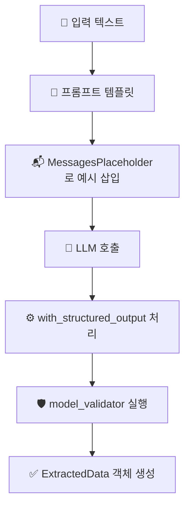

# 📋 LangChain 추출 component 정리


## 🚀 개요

이 문서는 LangChain의 `agent/extraction.py` 구현에서 사용된 핵심 개념들을 정리합니다. 

---

## 1. 📬 MessagesPlaceholder

### 정의
```python
MessagesPlaceholder("examples")
```

**역할**: 프롬프트 템플릿 내에서 동적으로 메시지 목록을 삽입할 수 있는 플레이스홀더

### 주요 기능
- ✅ 런타임에 메시지 리스트를 프롬프트에 삽입
- ✅ Few-shot 예시나 대화 히스토리 추가에 활용
- ✅ 프롬프트 구조를 유연하게 만들어줌

### 사용 예시
```python
# 프롬프트 템플릿 정의
prompt = ChatPromptTemplate.from_messages([
    ("system", "You are an expert extraction algorithm..."),
    MessagesPlaceholder("examples"),  # 🎯 동적 메시지 삽입점
    ("human", "Extract information from: {text}")
])

# 실행 시 examples 제공
result = prompt.invoke({
    "text": "김철수는 30세 개발자입니다.", 
    "examples": [example_message1, example_message2]
})
```

### 장점
- 📈 **성능 향상**: Few-shot 예시로 추출 정확도 개선
- 🔄 **유연성**: 상황에 따라 다른 예시 세트 사용 가능
- 🎛️ **제어 가능**: 예시 포함/제외를 런타임에 결정

---

## 2. 🛡️ @model_validator 데코레이터

### 정의
```python
@model_validator(mode='before')
@classmethod
def validate_lists(cls, data):
    if isinstance(data, dict):
        if data.get('people') is None:
            data['people'] = []
        if data.get('companies') is None:
            data['companies'] = []
    return data
```

### 역할
**Pydantic 모델의 데이터 검증 및 전처리를 담당하는 커스텀 밸리데이터**

### 모드 설명
| 모드 | 실행 시점 | 용도 |
|------|----------|------|
| **`mode='before'`** | 필드별 검증 전 | 데이터 전처리, 형태 변환 |
| **`mode='after'`** | 모든 필드 검증 후 | 후처리, 추가 검증 |

### 해결한 문제
```python
# ❌ 문제: LLM이 None 반환 시 오류 발생
# companies: None  <- List 타입 기대하지만 None 받음
# 🔥 ValidationError: Input should be a valid list

# ✅ 해결: validator가 자동 변환
# companies: None → companies: []
```

### 실제 적용 사례
```python
class ExtractedData(BaseModel):
    people: List[Person] = Field(default_factory=list)
    companies: List[Company] = Field(default_factory=list)
    
    @model_validator(mode='before')
    @classmethod
    def validate_lists(cls, data):
        """None 값을 빈 리스트로 자동 변환"""
        if isinstance(data, dict):
            if data.get('people') is None:
                data['people'] = []
            if data.get('companies') is None:
                data['companies'] = []
        return data
```

---

## 3. ⚙️ with_structured_output() 파라미터

### 정의
```python
self.llm.with_structured_output(
    schema=ExtractedData,
    method="function_calling",
    include_raw=False,
)
```

### 파라미터 상세 설명

#### 🏗️ `schema` (필수)
```python
schema=ExtractedData
```
- **역할**: 출력 스키마 정의
- **입력**: Pydantic 모델
- **기능**: 
  - LLM이 이 구조에 맞춰 데이터 생성
  - 타입 검증 및 필드 설명 제공
  - 필드별 description을 LLM에게 전달

#### 🔧 `method` (선택)
```python
method="function_calling"  # 권장값
```

| 값 | 설명 | 장점 | 단점 |
|---|------|------|------|
| `"function_calling"` | 함수 호출 방식 | 높은 정확도, 안정성 | 함수 호출 지원 모델 필요 |
| `"json_mode"` | JSON 모드 | 넓은 모델 지원 | 상대적으로 낮은 정확도 |
| `"json_schema"` | JSON 스키마 | 스키마 검증 | 복잡한 설정 |

#### 📦 `include_raw` (선택)
```python
include_raw=False  # 기본값
```

| 값 | 반환 내용 | 사용 시기 |
|---|----------|----------|
| `False` | 구조화된 데이터만 | 일반적인 사용 (권장) |
| `True` | 원본 응답 + 구조화된 데이터 | 디버깅, 분석 필요 시 |

---

## 4. 🔄 전체 처리 흐름



### 단계별 설명

1. **📝 입력 텍스트**: 한국어/영어 원본 텍스트
2. **🎯 프롬프트 템플릿**: 시스템 메시지 + 예시 + 사용자 입력
3. **📬 MessagesPlaceholder**: Few-shot 예시 동적 삽입
4. **🤖 LLM 호출**: OpenAI GPT 모델 실행
5. **⚙️ with_structured_output**: 구조화된 출력 변환
6. **🛡️ model_validator**: 데이터 검증 및 전처리
7. **✅ ExtractedData**: 최종 구조화된 데이터 객체

---

## 7. 🔧 트러블슈팅

### 자주 발생하는 문제들

#### ❌ ValidationError: Input should be a valid list
**원인**: LLM이 None 반환, List 타입 기대
**해결**: `@model_validator`로 None → [] 자동 변환

#### ❌ tool_example_to_messages() missing argument
**원인**: 함수 호출 방식 변경
**해결**: 올바른 파라미터 순서로 호출

---

## 📚 참고 자료

- [LangChain 공식 문서](https://python.langchain.com/docs/tutorials/extraction/)
- [Pydantic 문서](https://docs.pydantic.dev/)

---

*이 가이드는 LangChain v0.3+ 기준으로 작성되었습니다.* 