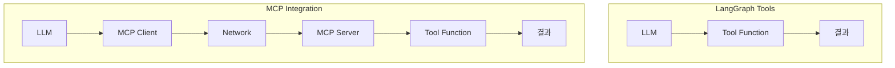
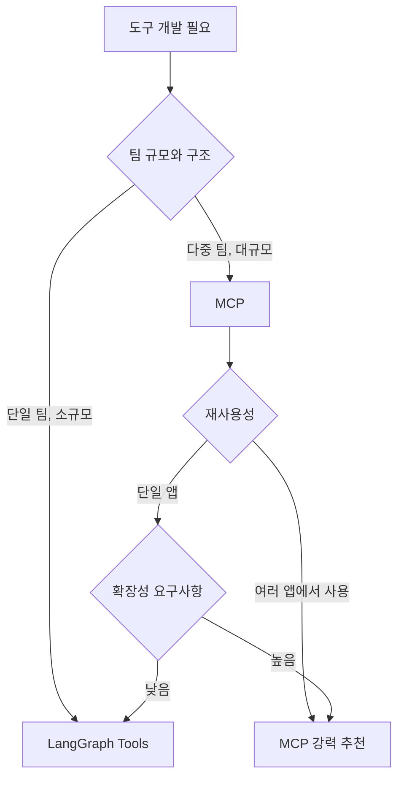

# 🔗 LangGraph에서 MCP 통합: 분산 도구 시스템 구축

> LangGraph와 MCP(Model Context Protocol)의 통합을 통한 확장 가능한 AI 도구 아키텍처 구축 가이드

## 📚 목차

- [MCP vs LangGraph Tools 비교](#-mcp-vs-langgraph-tools-비교)
- [MCP를 LangGraph에 통합하기](#-mcp를-langgraph에-통합하기)
- [실제 사용 사례와 예제](#-실제-사용-사례와-예제)
- [선택 가이드: 언제 무엇을 사용할까](#-선택-가이드-언제-무엇을-사용할까)
- [베스트 프랙티스](#-베스트-프랙티스)
- [결론](#-결론)

---

## 🤔 MCP vs LangGraph Tools 비교

### 본질적 유사성
**둘 다 LLM이 외부 기능에 접근하는 수단!**

#### 공통점
- ✅ **Function Calling 패턴** 사용
- ✅ **JSON Schema**로 매개변수 정의
- ✅ **LLM이 도구를 이해하고 호출**할 수 있도록 추상화
- ✅ **같은 두뇌(LLM)**를 사용하여 도구 선택과 실행

```python
# LangGraph Tool
@tool
def search_web(query: str) -> str:
    """웹 검색을 수행합니다."""
    return "검색 결과"

# MCP Tool (서버 측)
@server.call_tool()
async def search_web(arguments: dict) -> list[TextContent]:
    """웹 검색을 수행합니다."""
    query = arguments["query"]
    return [TextContent(type="text", text="검색 결과")]
```

### 핵심 차이점

| 측면 | LangGraph Tools | MCP |
|------|-----------------|-----|
| **아키텍처** | 인메모리 함수 호출 | 클라이언트-서버 통신 |
| **배포** | 애플리케이션에 내장 | 독립적인 서비스 |
| **재사용성** | 프로젝트별 | 여러 클라이언트 공유 |
| **확장성** | 수직적 확장 | 수평적 확장 |
| **복잡성** | 낮음 | 중간 |
| **네트워크** | 불필요 | 필수 |

### 🎯 언제 같고 언제 다른가?

#### 같은 경우 (LLM 관점)
```python
# 둘 다 LLM에게는 동일하게 보임
tools = [
    {"name": "search_web", "description": "웹 검색", "parameters": {...}},
    {"name": "calculate", "description": "계산", "parameters": {...}}
]
```

#### 다른 경우 (시스템 관점)


---

## 🔧 MCP를 LangGraph에 통합하기

### 1. MCP 클라이언트 설정

```python
from mcp import ClientSession, StdioServerParameters
from mcp.client.stdio import stdio_client
import asyncio

class MCPToolIntegration:
    """MCP 서버와 통신하여 도구를 LangGraph에서 사용할 수 있게 하는 클래스"""
    
    def __init__(self, server_path: str, server_args: list[str] = None):
        """
        MCP 통합 클래스 초기화
        
        Args:
            server_path: MCP 서버 실행 파일 경로
            server_args: 서버 실행 시 추가 인자들
        """
        self.server_params = StdioServerParameters(
            command=server_path,
            args=server_args or []
        )
        self.session = None
        self.available_tools = {}
    
    async def connect(self):
        """MCP 서버에 연결"""
        self.session = await stdio_client(self.server_params)
        await self.session.initialize()
        
        # 사용 가능한 도구들 가져오기
        tools_response = await self.session.list_tools()
        for tool in tools_response.tools:
            self.available_tools[tool.name] = tool
    
    async def call_tool(self, name: str, arguments: dict):
        """MCP 도구 호출"""
        if not self.session:
            raise RuntimeError("MCP 세션이 초기화되지 않았습니다")
        
        result = await self.session.call_tool(name, arguments)
        return result
```

### 2. LangGraph Tool로 래핑

```python
from langchain_core.tools import tool
from typing import Any, Dict

def create_langgraph_tool_from_mcp(mcp_integration: MCPToolIntegration, tool_name: str):
    """
    MCP 도구를 LangGraph Tool로 변환하는 팩토리 함수
    
    Args:
        mcp_integration: MCP 통합 객체
        tool_name: 변환할 MCP 도구 이름
    
    Returns:
        LangGraph에서 사용할 수 있는 Tool 객체
    """
    mcp_tool = mcp_integration.available_tools[tool_name]
    
    @tool(name=tool_name, description=mcp_tool.description)
    async def mcp_wrapped_tool(**kwargs) -> str:
        """MCP 도구를 호출하는 래퍼 함수"""
        try:
            result = await mcp_integration.call_tool(tool_name, kwargs)
            # MCP 결과를 문자열로 변환
            if hasattr(result, 'content') and result.content:
                return '\n'.join([
                    content.text if hasattr(content, 'text') else str(content)
                    for content in result.content
                ])
            return str(result)
        except Exception as e:
            return f"도구 실행 중 오류 발생: {str(e)}"
    
    return mcp_wrapped_tool
```

### 3. LangGraph 그래프에 통합

```python
from langgraph import StateGraph, START, END
from typing import TypedDict
import asyncio

class AgentState(TypedDict):
    """에이전트 상태 정의"""
    messages: list
    current_task: str
    tool_results: dict

async def setup_mcp_enabled_graph():
    """MCP 도구가 통합된 LangGraph 그래프 설정"""
    
    # MCP 통합 설정
    mcp_integration = MCPToolIntegration("path/to/mcp/server")
    await mcp_integration.connect()
    
    # MCP 도구들을 LangGraph Tool로 변환
    tools = []
    for tool_name in mcp_integration.available_tools.keys():
        langgraph_tool = create_langgraph_tool_from_mcp(mcp_integration, tool_name)
        tools.append(langgraph_tool)
    
    # LLM과 도구들 바인딩
    from langchain_openai import ChatOpenAI
    llm = ChatOpenAI(model="gpt-4")
    llm_with_tools = llm.bind_tools(tools)
    
    def agent_node(state: AgentState):
        """에이전트 노드: LLM이 도구를 선택하고 실행"""
        messages = state["messages"]
        response = llm_with_tools.invoke(messages)
        
        # 도구 호출이 있는 경우 실행
        if response.tool_calls:
            tool_results = {}
            for tool_call in response.tool_calls:
                # 비동기 도구 호출 처리
                tool_name = tool_call["name"]
                tool_args = tool_call["args"]
                
                # 실제 환경에서는 비동기 처리 필요
                result = asyncio.run(
                    mcp_integration.call_tool(tool_name, tool_args)
                )
                tool_results[tool_name] = result
            
            return {
                "messages": messages + [response],
                "tool_results": tool_results
            }
        
        return {"messages": messages + [response]}
    
    # 그래프 구성
    workflow = StateGraph(AgentState)
    workflow.add_node("agent", agent_node)
    workflow.add_edge(START, "agent")
    workflow.add_edge("agent", END)
    
    return workflow.compile()
```

---

## 💡 실제 사용 사례와 예제

### 사례 1: 분산 데이터 처리 시스템

```python
# MCP 서버들: 각각 다른 데이터 소스 담당
# - database_server: 데이터베이스 쿼리
# - api_server: 외부 API 호출
# - file_server: 파일 시스템 작업

class DistributedDataProcessor:
    """분산된 MCP 서버들을 활용한 데이터 처리 시스템"""
    
    def __init__(self):
        self.mcp_servers = {
            'database': MCPToolIntegration("./servers/database_server"),
            'api': MCPToolIntegration("./servers/api_server"),
            'file': MCPToolIntegration("./servers/file_server")
        }
    
    async def setup_distributed_graph(self):
        """분산 처리를 위한 그래프 설정"""
        # 모든 MCP 서버 연결
        for server in self.mcp_servers.values():
            await server.connect()
        
        # 각 서버의 도구들을 LangGraph에 통합
        all_tools = []
        for server_name, server in self.mcp_servers.items():
            for tool_name in server.available_tools.keys():
                tool = create_langgraph_tool_from_mcp(server, tool_name)
                # 서버별로 네임스페이스 추가
                tool.name = f"{server_name}_{tool.name}"
                all_tools.append(tool)
        
        return all_tools

# 사용 예제
async def main():
    processor = DistributedDataProcessor()
    tools = await processor.setup_distributed_graph()
    
    # LLM이 여러 데이터 소스를 조합하여 작업 수행
    # "사용자 데이터를 데이터베이스에서 가져오고, 외부 API로 보강한 후, 파일로 저장해줘"
```

### 사례 2: 마이크로서비스 아키텍처

```python
class MicroserviceOrchestrator:
    """마이크로서비스들을 MCP로 연결하는 오케스트레이터"""
    
    def __init__(self):
        self.services = {
            'user_service': MCPToolIntegration("./services/user_service"),
            'payment_service': MCPToolIntegration("./services/payment_service"),
            'notification_service': MCPToolIntegration("./services/notification_service")
        }
    
    async def create_workflow(self):
        """서비스 간 워크플로우 생성"""
        # 각 서비스를 LangGraph 노드로 변환
        workflow = StateGraph(AgentState)
        
        # LLM이 서비스 호출 순서와 매개변수를 결정
        def orchestrator_node(state: AgentState):
            """오케스트레이터 노드: 여러 마이크로서비스 조정"""
            task = state["current_task"]
            
            # LLM이 작업을 분석하고 필요한 서비스들 호출
            # 예: "사용자 등록" -> user_service -> payment_service -> notification_service
            
            return state
        
        workflow.add_node("orchestrator", orchestrator_node)
        return workflow.compile()
```

---

## 🎯 선택 가이드: 언제 무엇을 사용할까

### LangGraph Tools를 사용해야 할 때

#### ✅ 적합한 상황
- **간단한 프로토타입**이나 단일 애플리케이션
- **낮은 지연시간**이 중요한 경우
- **개발 속도**가 우선인 경우
- **단일 팀**에서 관리하는 도구들

```python
# 간단하고 빠른 개발
@tool
def simple_calculator(a: int, b: int) -> int:
    """간단한 계산기"""
    return a + b

tools = [simple_calculator]
llm_with_tools = llm.bind_tools(tools)
```

### MCP를 사용해야 할 때

#### ✅ 적합한 상황
- **여러 애플리케이션**에서 도구를 공유해야 할 때
- **팀 간 협업**이 필요한 경우
- **확장성**이 중요한 대규모 시스템
- **버전 관리**와 **독립적 배포**가 필요할 때

```python
# 확장 가능하고 재사용 가능한 아키텍처
mcp_servers = [
    "data_analysis_server",  # 데이터팀 관리
    "ml_model_server",       # ML팀 관리
    "api_integration_server" # 백엔드팀 관리
]

# 각 팀이 독립적으로 서버 업데이트 가능
```

### 🏗️ 하이브리드 접근법

```python
class HybridToolSystem:
    """LangGraph Tools와 MCP를 함께 사용하는 시스템"""
    
    def __init__(self):
        # 빠른 로컬 도구들
        self.local_tools = [
            simple_math_tool,
            text_processing_tool
        ]
        
        # 복잡한 외부 서비스들
        self.mcp_integrations = [
            MCPToolIntegration("complex_data_service"),
            MCPToolIntegration("ml_inference_service")
        ]
    
    async def get_all_tools(self):
        """모든 도구들을 통합하여 반환"""
        all_tools = self.local_tools.copy()
        
        # MCP 도구들 추가
        for mcp in self.mcp_integrations:
            await mcp.connect()
            for tool_name in mcp.available_tools.keys():
                mcp_tool = create_langgraph_tool_from_mcp(mcp, tool_name)
                all_tools.append(mcp_tool)
        
        return all_tools
```

---

## 🎨 베스트 프랙티스

### 1. 에러 처리와 복원력

```python
class ResilientMCPIntegration:
    """복원력 있는 MCP 통합"""
    
    def __init__(self, server_path: str, max_retries: int = 3):
        self.server_path = server_path
        self.max_retries = max_retries
        self.session = None
    
    async def call_tool_with_retry(self, name: str, arguments: dict):
        """재시도 로직이 포함된 도구 호출"""
        for attempt in range(self.max_retries):
            try:
                if not self.session:
                    await self.connect()
                
                result = await self.session.call_tool(name, arguments)
                return result
                
            except Exception as e:
                if attempt == self.max_retries - 1:
                    return f"도구 호출 실패 (최대 재시도 초과): {str(e)}"
                
                # 연결 재시도
                await asyncio.sleep(2 ** attempt)  # 지수 백오프
                self.session = None
```

### 2. 성능 최적화

```python
class OptimizedMCPManager:
    """성능 최적화된 MCP 관리자"""
    
    def __init__(self):
        self.connection_pool = {}  # 연결 풀링
        self.tool_cache = {}       # 도구 메타데이터 캐싱
    
    async def get_cached_tools(self, server_name: str):
        """캐시된 도구 정보 반환"""
        if server_name not in self.tool_cache:
            # 첫 연결 시에만 도구 정보 캐싱
            integration = self.connection_pool[server_name]
            await integration.connect()
            self.tool_cache[server_name] = integration.available_tools
        
        return self.tool_cache[server_name]
```

### 3. 모니터링과 로깅

```python
import logging
from datetime import datetime

class MonitoredMCPIntegration(MCPToolIntegration):
    """모니터링이 포함된 MCP 통합"""
    
    def __init__(self, *args, **kwargs):
        super().__init__(*args, **kwargs)
        self.logger = logging.getLogger(f"mcp.{self.server_params.command}")
        self.call_stats = {"success": 0, "failure": 0}
    
    async def call_tool(self, name: str, arguments: dict):
        """로깅과 메트릭이 포함된 도구 호출"""
        start_time = datetime.now()
        
        try:
            self.logger.info(f"도구 호출 시작: {name} with {arguments}")
            result = await super().call_tool(name, arguments)
            
            duration = (datetime.now() - start_time).total_seconds()
            self.logger.info(f"도구 호출 성공: {name} ({duration:.2f}s)")
            self.call_stats["success"] += 1
            
            return result
            
        except Exception as e:
            duration = (datetime.now() - start_time).total_seconds()
            self.logger.error(f"도구 호출 실패: {name} ({duration:.2f}s) - {str(e)}")
            self.call_stats["failure"] += 1
            raise
```

---

## 🎯 결론

### 핵심 인사이트

1. **본질적으로 같은 목적**: LangGraph Tools와 MCP 모두 LLM이 외부 기능을 사용할 수 있게 하는 도구
2. **아키텍처의 차이**: 인메모리 vs 분산 시스템
3. **선택의 기준**: 프로젝트 규모, 팀 구조, 재사용성 요구사항

### 언제 MCP를 선택해야 할까?




- **도구의 독립적 개발과 배포**
- **팀 간 협업 향상**
- **시스템의 확장성과 유지보수성 개선**

결국 **같은 두뇌(LLM)** 를 사용하지만, **시스템 아키텍처의 선택**에 따라 개발 경험과 운영 복잡성이 달라진다. 프로젝트의 요구사항에 맞는 적절한 선택이 중요!
